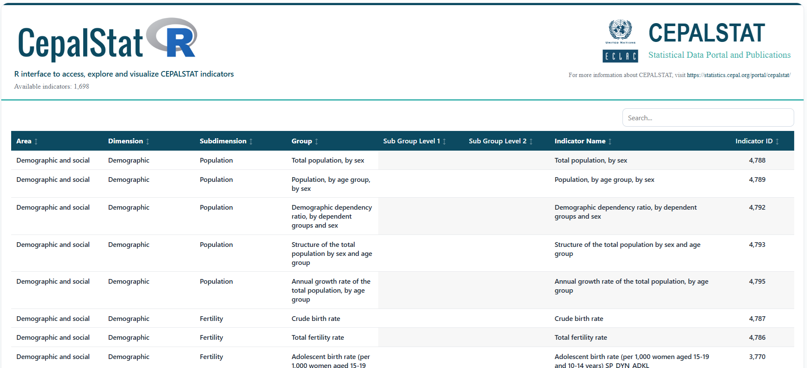
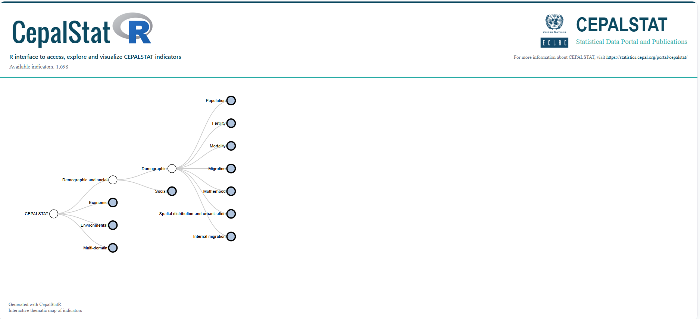

# CepalStatR

<!-- badges: start -->
[](https://github.com/Henry-Osorto/CepalStatR/actions)
[](LICENSE)
<!-- badges: end -->

<p align="center">
  
</p>

<p align="center">
  <strong>R interface to access, explore and visualize CEPALSTAT indicators</strong>
</p>

<p align="center">
  <a href="https://statistics.cepal.org/portal/cepalstat/">CEPALSTAT Portal</a> ·
  <a href="https://doi.org/10.18687/LACCEI2024.1.1.1473">Paper (LACCEI 2024)</a> ·
  <a href="https://github.com/Henry-Osorto/CepalStatR/issues">Report Issue</a>
</p>

---

## Overview

**CepalStatR** is an R package that provides a reproducible and user-friendly interface to access data and metadata from **CEPALSTAT**, the statistical portal of the Economic Commission for Latin America and the Caribbean (**ECLAC/CEPAL**).

The package is designed to simplify the interaction with the CEPALSTAT API, allowing users to:

- explore the hierarchical structure of indicators,
- download data in tidy formats,
- and generate both static and interactive visualizations.

It is particularly useful for **researchers, analysts, and students** working with Latin American and Caribbean statistics.

---

## Main Features

- Access CEPALSTAT indicators directly from R
- Retrieve metadata and hierarchical structures
- Download indicator data in tidy format
- List countries available in CEPALSTAT
- Generate demographic visualizations (population pyramids)
- Create SDG indicator rankings
- Explore indicators via interactive tables and thematic maps

---

## Installation

Install the development version from GitHub:

```r
# install.packages("devtools")
devtools::install_github("Henry-Osorto/CepalStatR")
```

## Quick start

```r
library(CepalStatR)

# Interactive indicator browser
viewer.indicators()

# Download the indicator hierarchy as a data frame
indicators <- call.indicators()

# Download indicator data
df <- call.data(id.indicator = 1)

# Available countries
countries()

# Population pyramids
pyramids(country = "Honduras", years = c(1, 5, 10, 15))

# SDG ranking
ranking.sdg(id.indicator = 3682)

# Interactive thematic map
topic_map()
```

## Core functions

### Metadata and exploration

- `call.indicators()` — downloads the thematic structure of CEPALSTAT indicators
- `viewer.indicators()` — displays the indicator hierarchy in an interactive HTML table
- `topic_map()` — creates an interactive thematic tree of indicators
- `countries()` — returns the list of available countries from CEPALSTAT dimensions

### Data retrieval

- `call.data()` — downloads indicator data and returns an analysis-ready data frame

### Visualization

- `pyramids()` — generates population pyramids using CEPALSTAT demographic indicators
- `ranking.sdg()` — creates ranking plots for indicators associated with the Sustainable Development Goals

## Screenshots

### Interactive indicator viewer

<p align="center">
  
</p>

### Interactive thematic map

<p align="center">
  
</p>

## Data source

All data and metadata are obtained from **CEPALSTAT**:

https://statistics.cepal.org/portal/cepalstat/

## Why use CepalStatR?

CEPALSTAT provides a rich statistical infrastructure for Latin America and the Caribbean, but direct use of its API may be cumbersome for many users. **CepalStatR** simplifies that process by offering a consistent R interface for metadata discovery, reproducible data acquisition, tidy outputs, and built-in visual tools for exploratory and applied analysis.

This makes the package especially suitable for:

- empirical research
- policy analysis
- reproducible workflows
- academic teaching
- exploratory analysis of regional statistics

## Citation

If you use **CepalStatR** in academic work, please cite the conference paper that documents the package:

Osorto, H. (2024). *CepalStatR: a package in R for access to ECLAC statistics*. 22nd LACCEI International Multi-Conference for Engineering, Education, and Technology. https://doi.org/10.18687/LACCEI2024.1.1.1473

### BibTeX

```bibtex
@inproceedings{Osorto2024CepalStatR,
  author    = {Henry Osorto},
  title     = {CepalStatR: a package in R for access to ECLAC statistics},
  booktitle = {22nd LACCEI International Multi-Conference for Engineering, Education, and Technology},
  year      = {2024},
  doi       = {10.18687/LACCEI2024.1.1.1473}
}
```

## Project status

The package currently includes a CRAN-ready structure, interactive exploration tools, indicator retrieval functions, and built-in visualization features. Future development may extend the package with additional metadata utilities, thematic graphics, and analytical workflows.

## Reporting issues

Bug reports, suggestions, and feature requests are welcome through the GitHub issue tracker:

https://github.com/Henry-Osorto/CepalStatR/issues
